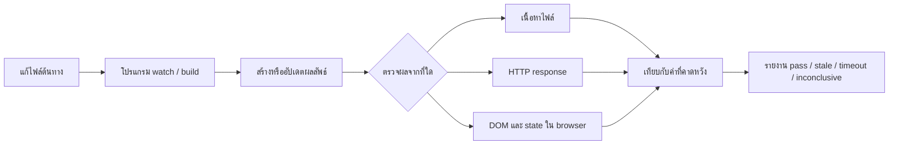

# Watchmode Truth Lab

Watchmode Truth Lab เป็นเครื่องมือ CLI สำหรับตรวจว่า **หลังแก้ไฟล์แล้ว โปรแกรมที่เฝ้าดูไฟล์นั้นแสดงผลล่าสุดจริงหรือไม่** เหมาะกับการตรวจ build tool, code generator และ development server โดยไม่ต้องรู้ว่าเครื่องมือเฝ้าดูไฟล์ทำงานภายในอย่างไร

เครื่องมือคัดลอก fixture ไปยังพื้นที่ชั่วคราว แก้ไฟล์ด้วยวิธีที่กำหนด แล้วตรวจผลลัพธ์ปลายทางเทียบกับค่าที่คาดหวัง พร้อมบันทึกเวลา hash จำนวนครั้งที่ตรวจ และเหตุผลของผลลัพธ์เป็น JSON

## นึกภาพตามได้อย่างไร

เมื่อบันทึกไฟล์ โปรแกรมที่เฝ้าดูไฟล์ควรสร้างผลลัพธ์ใหม่ เครื่องมือนี้จำลองการแก้ไฟล์ แล้วตรวจสิ่งที่มองเห็นได้จริง:



ตัวอย่างเช่น เปลี่ยน token จาก `เก่า` เป็น `ใหม่` ด้วยการเขียนทับหรือแทนที่ไฟล์ทั้งก้อน แล้วตรวจว่าไฟล์ที่สร้างหรือหน้าเว็บแสดง `ใหม่` ภายในเวลาที่กำหนดหรือไม่ รายงานช่วยบอกได้ว่าเห็นค่าล่าสุดทันเวลา อ่านผลไม่ทัน หรือยังสรุปไม่ได้

## ช่วยใคร และช่วยอย่างไร

- **นักพัฒนาเว็บและผู้ทำเครื่องมือ build** — ตรวจว่าการบันทึกไฟล์แบบที่ใช้จริงทำให้ output หรือหน้าเว็บอัปเดตตามหรือไม่
- **ผู้ดูแล watcher, compiler หรือ code generator** — เปรียบเทียบวิธีแก้ไฟล์ เช่น เขียนทับ แทนที่แบบ atomic หรือเขียนหลายช่วง แล้วเก็บผลที่ทำซ้ำได้
- **ทีม QA และ CI** — แนบรายงาน JSON ซึ่งมีสถานะ เวลา hash และ log เพื่อช่วยตรวจปัญหา freshness ซ้ำภายหลัง

เครื่องมือบอกได้ว่าผลลัพธ์ที่สังเกตเห็นตรงหรือไม่ตรงตามเงื่อนไข แต่ไม่ได้อนุมานสาเหตุของ event จากระบบไฟล์ หากผลเป็น `stale` ยังต้องใช้ log และการทดลองควบคุมเพื่อหาต้นเหตุ

## ใช้ตรวจอะไรได้บ้าง

- **ไฟล์** — ตรวจ bytes ของไฟล์ที่โปรแกรมสร้าง
- **HTTP** — ตรวจ response จาก development server
- **หน้าเว็บของ Vite** — ตรวจ DOM, การคงอยู่ของหน้า และ state ผ่าน browser adapter

## สิ่งที่ต้องมี

- Python 3.10 ขึ้นไป
- สำหรับตัวอย่าง Vite: Node.js และ pnpm
- สำหรับตรวจ DOM: browser ที่รองรับและ dependency ของระบบปฏิบัติการ

## ติดตั้ง

### จาก source code

โคลน repository แล้วเข้าโฟลเดอร์โปรเจกต์:

```sh
git clone https://github.com/lenulk/Watchmode-Truth-Lab.git
cd Watchmode-Truth-Lab
python -m venv .venv
```

เปิดใช้ virtual environment และติดตั้งแพ็กเกจ:

Windows PowerShell:

```powershell
.\.venv\Scripts\Activate.ps1
python -m pip install .
```

macOS / Linux:

```sh
source .venv/bin/activate
python -m pip install .
```

หาก Windows ไม่อนุญาตให้เปิดใช้ environment ใน PowerShell ให้เรียก `.venv\Scripts\python.exe` แทน `python` ในคำสั่งด้านล่าง ส่วน Linux บางรุ่นอาจต้องติดตั้งแพ็กเกจ `python3-venv` ก่อนสร้าง environment

### จาก wheel

หากดาวน์โหลดไฟล์ `.whl` จาก GitHub Release แล้ว ให้ติดตั้งใน virtual environment:

```sh
python -m pip install /path/to/watchmode_truth_lab-1.0.0-py3-none-any.whl
```

## เริ่มต้นใช้งาน

สร้างตัวอย่างสำหรับตรวจ output ของไฟล์ในโฟลเดอร์ใหม่:

```sh
python -m watchmode_truth_lab --init demo --template file
cd demo
```

ตรวจการตั้งค่าก่อน แล้วรันการทดลอง 3 รอบ:

Windows PowerShell:

```powershell
..\.venv\Scripts\python.exe -m watchmode_truth_lab scenario.json --validate
..\.venv\Scripts\python.exe -m watchmode_truth_lab scenario.json --rounds 3 --mutation atomic_replace --format summary --report reports/result.json
```

macOS / Linux:

```sh
../.venv/bin/python -m watchmode_truth_lab scenario.json --validate
../.venv/bin/python -m watchmode_truth_lab scenario.json --rounds 3 --mutation atomic_replace --format summary --report reports/result.json
```

`--init` ต้องใช้ชื่อโฟลเดอร์ปลายทางที่ยังไม่มีอยู่ คำสั่งในตัวอย่างสร้าง fixture ขนาดเล็กและเริ่มโปรแกรมตัวอย่างให้แล้ว โดยไม่ต้องติดตั้ง Vite

## อ่านผลอย่างไร

- `pass` — output ตรงกับค่าที่คาดไว้ต่อเนื่องตามช่วงเวลาที่ตั้ง
- `stale` — อ่าน output ได้ แต่ไม่พบค่าล่าสุดที่ตรงกันภายในเวลาที่กำหนด
- `timeout` — อ่าน output ไม่ทันกำหนดเวลา
- `inconclusive` — เริ่มโปรแกรมไม่พร้อม โปรแกรมหยุด หรือมีเงื่อนไขภายนอกที่ทำให้สรุปผลไม่ได้

Exit code `0` หมายถึงผ่าน, `1` หมายถึง freshness ไม่ผ่านหรือยังสรุปไม่ได้ และ `2` หมายถึง configuration, dependency หรือการเขียน report มีปัญหา รายงานเก็บรายละเอียดและ log เพิ่มเติม:

```sh
python -m watchmode_truth_lab scenario.json --rounds 3 --mutation overwrite --report reports/result.json
python -m watchmode_truth_lab scenario.json --rounds 3 --mutation overwrite --format summary
```

ตัวเลือก mutation ได้แก่ `overwrite`, `atomic_replace` และ `burst` ผล `pass` ยืนยันเฉพาะ output ที่สังเกตได้ตามช่วงเวลาและนโยบายของ scenario ไม่ได้พิสูจน์ว่าจะถูกต้องตลอดเวลา หรือยืนยันสาเหตุของปัญหาใน watcher

## ทดลองกับ Vite และ browser

สร้าง starter แบบอื่นได้ด้วย `vite-http` หรือ `vite-browser`:

```sh
python -m watchmode_truth_lab --init demo-vite --template vite-http
cd demo-vite
pnpm install --frozen-lockfile
python -m watchmode_truth_lab scenario.json --rounds 3 --mutation atomic_replace --report reports/vite.json
```

starter ของ Vite ต้องติดตั้ง Node.js และ pnpm ก่อน ส่วน `vite-browser` ต้องมี browser และไลบรารีระบบที่ Playwright ใช้ด้วย หากใช้ `vite-browser` ให้เปลี่ยน `--template` เป็น `vite-browser` และติดตั้ง browser ตาม [คู่มือผู้ใช้](docs/user-guide.md)

## ข้อควรทราบ

- เครื่องมือนี้รันคำสั่งที่ระบุใน scenario ควรใช้เฉพาะคำสั่งและ fixture ที่เชื่อถือ
- ห้ามใส่ credential หรือข้อมูลจริงที่เป็นความลับใน fixture หรือรายงานที่จะแชร์ เพราะ log จากโปรแกรมย่อยอาจมี path หรือข้อมูลอื่นติดมาด้วย
- การตรวจเป็นการสุ่มสังเกตตามช่วงเวลา ไม่ใช่ระบบ real-time และไม่ยืนยันว่าผลลัพธ์จะคงถูกต้องต่อไป
- ข้อจำกัดและสถานะการตรวจบน Windows, Linux และ browser ดูได้ใน [ผลการตรวจปัจจุบัน](docs/current-results.md)

## เอกสารเพิ่มเติม

- [คู่มือผู้ใช้และการติดตั้ง](docs/user-guide.md)
- [รูปแบบรายงานและความหมายของผล](docs/report-format.md)
- [ผลการตรวจปัจจุบัน](docs/current-results.md)
- [แผนพัฒนา](docs/development-plan.md)
- [ประวัติการทดสอบ](docs/test-log.md)
- [บันทึกการเปลี่ยนแปลง](CHANGELOG.md)

## License

MIT — ดูรายละเอียดใน [LICENSE](LICENSE)
